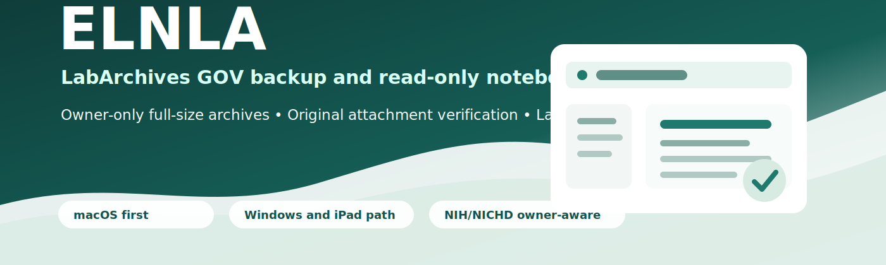
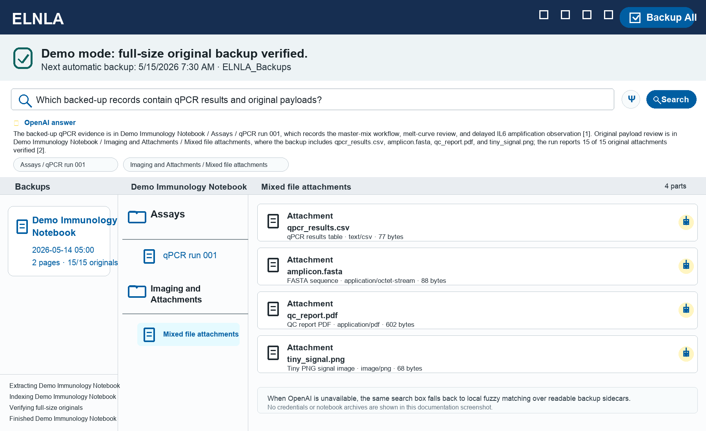
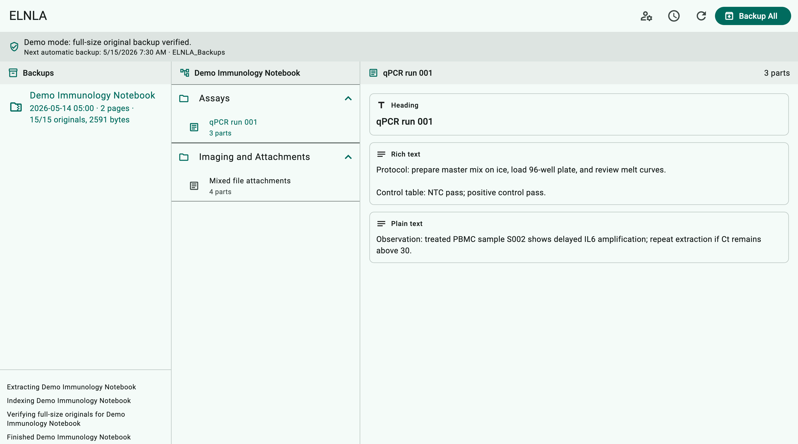
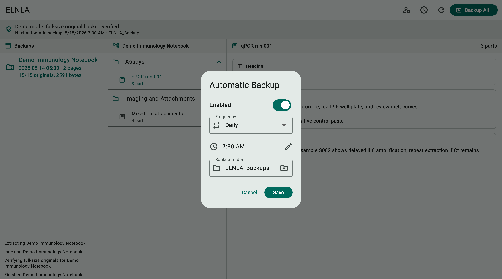

# ELNLA

ELNLA is a macOS-first LabArchives GOV backup and read-only viewer for
electronic lab notebooks. It helps eligible notebook owners preserve the
full-size LabArchives archive, verify original attachment files, and browse
backed-up notebooks without writing anything back to LabArchives.

## Why It Exists

At NIH and NICHD, lab notebook owners are lab chiefs/PIs. LabArchives full-size
notebook backup is owner-only: users who can view a notebook are not necessarily
allowed to download its full-size backup archive. ELNLA makes that rule visible
in the app and in the documentation so backup failures are easier to understand.

## Screenshots







## What It Does

- Prompts for LabArchives GOV credentials on first launch.
- Lets the user choose the local folder for routine backup copies.
- Backs up every notebook the authenticated user owns and can back up through
  the LabArchives API.
- Keeps the original LabArchives `.7z` archive for preservation.
- Extracts and indexes notebook pages for local read-only viewing.
- Writes a separate readable Markdown copy plus JSONL search chunks for every
  successful backup.
- Provides notebook search with local fuzzy fallback and OpenAI-powered
  natural-language answers when the user saves an OpenAI API key locally.
- Verifies reported original attachment files by byte size before marking a
  notebook backup successful.
- Seals each successful backup with a SHA-256 integrity manifest and warns in
  the viewer if any protected file changes later.
- Stores credentials, user access XML, notebook IDs, schedules, and backups in
  local ignored paths or in the user-selected backup folder.
- Supports manual backup plus daily or weekly scheduled backup while the app is
  open.

## Platform Strategy

- macOS is the first target and primary development environment.
- Windows support is scaffolded through Flutter; build on a Windows host.
- iPad support is scaffolded through Flutter iOS; build on a Mac with the
  required Xcode iOS platform components installed.
- Shared LabArchives, backup, parsing, and verification logic stays in Dart so
  platform-specific code remains small.
- Visual styling uses an NIH/HHS-aligned palette: federal blue as the primary
  action color, gold as a restrained secondary accent, and cool grays for
  dense notebook review surfaces.

Current status:

| Platform | Status |
| --- | --- |
| macOS | Native Flutter `.app` builds and runs. |
| Windows | Project scaffolded; host build still needed. |
| iPad | Project scaffolded; Xcode iOS platform setup still needed. |

## Repository Layout

```text
docs/
  assets/
    elnla-banner.svg
    screenshots/
  developer/
    labarchives_gov_api_reference.md
  user/
    ELNLA_Quickstart.pdf
    quickstart.md
lib/
  main.dart
  src/
scripts/
test/
tool/
```

## Documentation

- [Quickstart PDF](docs/user/ELNLA_Quickstart.pdf)
- [Quickstart source](docs/user/quickstart.md)
- [LabArchives GOV API working reference](docs/developer/labarchives_gov_api_reference.md)
- [Documentation index](docs/README.md)

The original LabArchives API source PDF is intentionally local-only under
`local_docs/` and is ignored by Git. The compact developer reference is the
tracked substitute used during implementation.

## Local-Only Data Rules

- Use paths relative to the project root in tracked files.
- Never commit machine-specific absolute paths.
- Never commit real credentials, tokens, access keys, local auth XML, notebook
  IDs, downloaded source PDFs, or raw notebook backups.
- Keep local setup files under ignored paths such as `local_credentials/`,
  `local_docs/`, `.env.local`, or a user-selected backup folder outside the
  repository.
- Commit placeholder templates only when examples are needed.

## Development

```sh
flutter analyze
flutter test
flutter build macos
scripts/run_macos_app.sh
```

Useful helper commands:

```sh
python3 scripts/labarchives_auth_flow.py --email your.email@example.gov --open-browser
python3 scripts/labarchives_seed_bio_test_notebook.py
dart run tool/backup_once.dart
python3 tool/build_quickstart_pdf.py
```

For clean public screenshots, run the app with demo data:

```sh
scripts/run_macos_app.sh --demo
```
